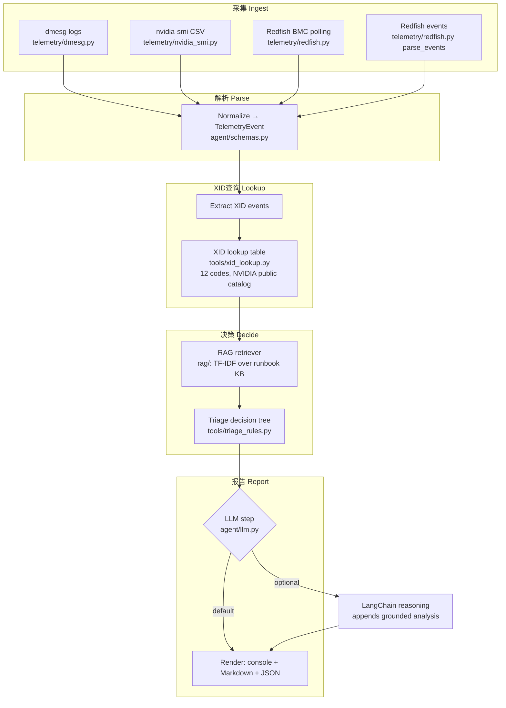

# AI-Node-Sentinel

**[English](README.md)** | [简体中文](README.zh-CN.md) | [日本語](README.ja.md) | [한국어](README.ko.md) | [Español](README.es.md) | [Português](README.pt.md) | [Русский](README.ru.md)

  

**A Post-Silicon & Hardware Diagnostic Agent powered by LangChain & Redfish Telemetry.**

An AI-agent-based diagnostic pipeline for GPU node failures in AI infrastructure:
it ingests node telemetry (kernel logs via a dmesg parser, `nvidia-smi` output,
and out-of-band Redfish BMC telemetry), identifies NVIDIA XID error events,
retrieves runbook evidence with a built-in RAG retriever, and produces a
Validation & Triage Report — so on-call engineers get "what broke, how bad,
what to do first" instead of raw `dmesg` output.

Built for the realities of large GPU fleets (post-silicon validation,
data-center operations, and AI training clusters where one bad GPU can stall
thousands of others).

> **Project status: v1.1 (honest edition).**
> The end-to-end pipeline runs today on **simulated** telemetry — every sample
> is synthetic and labeled as such. What is real: dmesg parsing, nvidia-smi
> parsing, the Redfish client interface, Redfish event-payload parsing,
> TF-IDF RAG retrieval over a runbook knowledge base, a 12-code XID lookup
> table verified against NVIDIA's public XID catalog, the heuristic triage
> decision tree, and markdown/JSON/console report rendering. The optional
> LangChain reasoning step activates when `requirements-llm.txt` is installed
> and an API key is set. Nothing here pretends to be a production
> diagnostician: triage rules are heuristic defaults — validate against your
> site runbook before operational use.

---

## Problem

In a 1,000+ GPU cluster, XID errors (NVIDIA's hardware/firmware error codes) are
the first signal that a GPU is degrading — but triage today is manual:

1. An engineer greps `dmesg` across nodes for `Xid`.
2. They look up what the code means (NVIDIA Xid catalog, tribal knowledge).
3. They decide: drain the node? reset the GPU? reboot? RMA the card?
4. Meanwhile the training job keeps retrying on broken hardware.

Slow triage = wasted GPU-hours = real money at AI-infra scale.

## Architecture



Why Redfish matters: when a GPU falls off the bus (XID 79), in-band tools like
`nvidia-smi` go blind — the driver can't see the card anymore. Redfish is the
**out-of-band backstop**: the BMC still reports inlet temperature, PSU
redundancy, and PCIe error counters, which is exactly the context needed to
tell "dead GPU" apart from "thermal trip / power problem".

Pipeline stages:

| Stage | Module | Status |
|---|---|---|
| dmesg XID parsing | `telemetry/dmesg.py` | ✅ Implemented |
| nvidia-smi CSV parsing (+DBE surfacing) | `telemetry/nvidia_smi.py` | ✅ Implemented |
| Redfish BMC client (interface + simulator) | `telemetry/redfish.py` | ✅ Implemented |
| Redfish event payload parsing (Event/MessageId/Severity → events) | `telemetry/redfish.py` `parse_events` | ✅ Implemented (v1.1) |
| XID code → metadata lookup | `tools/xid_lookup.py` | ✅ 12 codes from NVIDIA public catalog (Rel. 615) |
| RAG runbook retrieval (TF-IDF, stdlib-only) | `rag/` | ✅ Implemented (14 chunks) |
| Triage decision tree (drain/reset/escalate/ignore/monitor) | `tools/triage_rules.py` | ✅ Heuristic defaults, 12-code runbook |
| LLM chain-of-thought reasoning | `agent/llm.py` | ✅ Optional LangChain adapter |
| Report rendering (console + Markdown + JSON) | `agent/orchestrator.py`, `agent/report_md.py` | ✅ Implemented |
| Simulated telemetry generator | `telemetry/simulator.py` | ✅ Synthetic data only |

## Tech Stack

- **Python 3.11+**, `pydantic` for schemas, `pytest` for tests; GitHub Actions CI
- **RAG**: hand-rolled TF-IDF retriever (standard library only — runs on any node)
- **LangChain** (`requirements-llm.txt`, optional) — reasoning step only

## Quickstart (2 minutes, no GPU required)

```bash
git clone https://github.com/Ezra-Zhao/AI-Node-Sentinel.git
cd AI-Node-Sentinel
pip install -r requirements.txt && python examples/demo.py
```

The demo parses a synthetic dmesg capture, synthetic nvidia-smi output, and
simulated Redfish telemetry, runs RAG + triage, prints a report, and writes
`examples/demo_report.md` + `examples/demo_report.json`.

```bash
python -m pytest tests/ -q          # 28 tests
```

### Wiring a real LLM (optional)

```bash
pip install -r requirements-llm.txt   # langchain stack
export OPENAI_API_KEY=...
AI_SENTINEL_LLM=1 python examples/demo.py
```

Rules decide; the model explains — the LLM only appends a grounded analysis
line to each rationale, never overrides the decision tree.

## Demo output (excerpt)

```
[CRITICAL] GPU has fallen off the bus  (XID 79)
  node=node-01  gpu=-1
  action=DRAIN_NODE  confidence=0.80
  rationale: XID 79: driver lost the GPU on PCIe; Redfish thermal alert —
             likely a thermal trip, not a dead GPU.
  evidence: xid-79-bus, redfish-thermal

[CRITICAL] Double-bit ECC error (uncorrectable)  (XID 48)
  action=DRAIN_NODE  confidence=0.85
  rationale: XID 48: uncorrectable DRAM error. Drain the node so no new
             work lands on it; watch for recurrence before RMA.
  evidence: xid-48-dbe, redfish-power

[HIGH    ] Graphics Engine Exception  (XID 13)
  action=CHECK_APPLICATION  confidence=0.70
  rationale: XID 13: usually application-level. Check the app/deploy first;
             do NOT drain the node on a single occurrence.
```

Full markdown report: [`examples/demo_report.md`](examples/demo_report.md)
(ticket-ready: action summary → findings with cited runbook evidence).

## Roadmap

- [x] v1.0: parsers, Redfish interface, RAG, decision tree, reports, demo
- [x] v1.1: 12-code XID lookup (NVIDIA public catalog Rel. 615) + decision rules
  for 45/62/63/64/92, Redfish event payload parsing, 28 tests
- [ ] Real Redfish client (`requests` against BMC, session auth)
- [ ] `dmesg -T` live tail + DCGM exporter connector
- [ ] Recurring-fault detection across time windows (flapping GPUs)
- [ ] Alertmanager / PagerDuty webhook output

## License

MIT — see [LICENSE](LICENSE).

## Attribution

XID code metadata seeded from NVIDIA's public XID error documentation
(`https://docs.nvidia.com/deploy/xid-errors/`) and Google Cloud's GPU
troubleshooting guide. This repo is not affiliated with NVIDIA.

---

All code in this repository is clean-room code written by Guangyi Zhao for learning and research purposes. It does not contain any client or employer confidential information.
